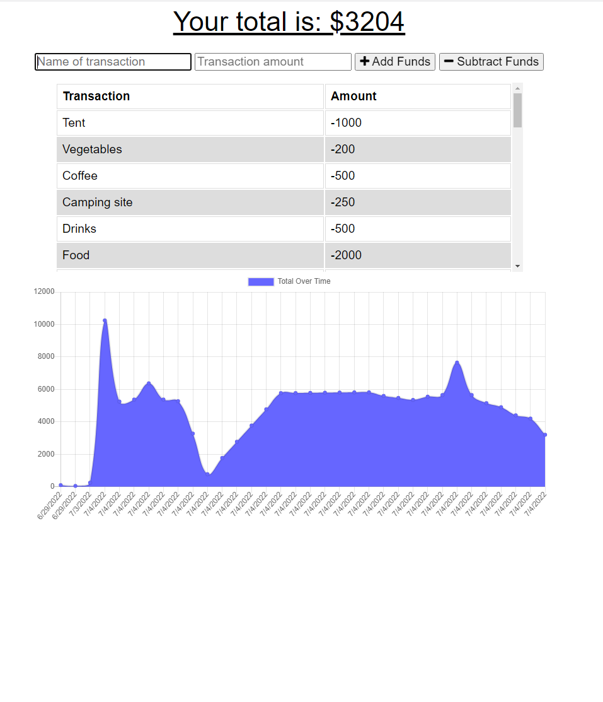

# Budget-Tracker

## Description

A progressive web application (PWA) that allows users to add expenses and deposits to their budget with or without a connection. If it is offline, the entered transactions would be saved in the indexedDB, then the total should be updated once it is back online. It is also able to download the app through web manifest.

## Built with

- JavaScript
- express
- MongoDB
- mongoose
- npm
- Web manifest
- Service Worker

## Installation

`npm init`

`npm install express`

`npm install mongoose`

## Usage

`npm start`

## Screenshot

